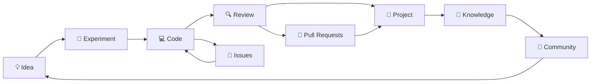

<div align="center">


# 👋 Welcome to ECUSTCIC-CodeHub

### An Open Code Community from East China University of Science and Technology

<p>
  <strong>Build together. Learn together. Share with everyone.</strong>
</p>

<p>
  ECUSTCIC-CodeHub is the code sharing and open-source collaboration platform of the
  <strong>CIC community at East China University of Science and Technology (ECUST)</strong>.
</p>

<br>

[](https://github.com/ECUSTCIC-CodeHub)
[](https://www.ecust.edu.cn/)
[](https://wiki.cic.cab/%E8%AE%A1%E7%AE%97%E6%9C%BA%E4%BF%A1%E6%81%AF%E4%BA%A4%E6%B5%81%E5%8D%8F%E4%BC%9A)
[](https://github.com/ECUSTCIC-CodeHub)

<br>


</div>

---

## 🌌 About Us

```text
$ whoami

Organization : ECUSTCIC-CodeHub
University   : East China University of Science and Technology
Community    : CIC
Mission      : Code · Create · Connect
Location     : Shanghai, China
Status       : Building...
```

**ECUSTCIC-CodeHub** is a student-driven development and code exchange community built around CIC at **East China University of Science and Technology**.

Here, code is more than a collection of files.

It is a record of exploration, a medium for collaboration, a way to transfer knowledge, and sometimes the beginning of something much bigger.

We hope to provide a place where students can:

* 💻 **Build** useful, interesting, and experimental software.
* 🧠 **Learn** modern technologies through real projects.
* 🤝 **Collaborate** with developers from different backgrounds.
* 📚 **Share** tutorials, engineering experience, tools, and ideas.
* 🌱 **Grow** from the first commit to maintaining real-world projects.
* 🚀 **Explore** everything from web development to systems, AI, infrastructure, and beyond.

> **We believe the best way to learn technology is to build something,
> and the best way to make technology meaningful is to share it.**

---

<div align="center">

## ✦ Our Philosophy ✦

<table>
<tr>
<td align="center" width="25%">
<h3>💡 Create</h3>
Turn curiosity into ideas<br>
and ideas into reality.
</td>
<td align="center" width="25%">
<h3>🧩 Collaborate</h3>
Great software is rarely<br>
built alone.
</td>
<td align="center" width="25%">
<h3>📖 Share</h3>
Knowledge becomes more<br>
valuable when shared.
</td>
<td align="center" width="25%">
<h3>🌱 Grow</h3>
Every repository can be<br>
the beginning of a journey.
</td>
</tr>
</table>

</div>

---

## 🛠️ Our Playground

We do not limit ourselves to a single language, framework, or field.

If it is interesting, useful, challenging, or simply worth exploring — **we build it.**

<div align="center">

### Languages


### Web & Application


### Engineering & Infrastructure


</div>

---

## 🪐 The CIC Open-Source Universe



Every contribution becomes part of a larger cycle:

**Ideas become experiments.
Experiments become code.
Code becomes projects.
Projects become knowledge.
Knowledge grows the community.**

---

## 🛰️ What You Can Find Here

<table>
<tr>
<td align="center" width="33%">

### 🧪 Experimental Projects

Interesting ideas, prototypes, tools, and technical experiments.

</td>
<td align="center" width="33%">

### 🎓 Learning Resources

Tutorials and projects designed to help developers learn by doing.

</td>
<td align="center" width="33%">

### 🛠️ Developer Tools

Utilities and infrastructure created to make development easier.

</td>
</tr>

<tr>
<td align="center">

### 🌐 Web Projects

Frontend, backend, full-stack applications, and community websites.

</td>
<td align="center">

### 🤖 AI Exploration

Experiments around AI applications, models, agents, and infrastructure.

</td>
<td align="center">

### 🎨 Creative Coding

Because programming should sometimes be fun for absolutely no reason.

</td>
</tr>
</table>

---

## 🤝 Join the Adventure

Open source is not only about publishing code.

It is about **people building things together**.

Whether you are taking your first steps into programming or already maintaining complex projects, there is always something you can contribute.

```bash
# Step 1 — Find something interesting
git clone https://github.com/ECUSTCIC-CodeHub/<repository>.git

# Step 2 — Create your branch
git checkout -b feature/your-awesome-idea

# Step 3 — Build something
vim awesome_code.*

# Step 4 — Commit it
git commit -m "feat: make something awesome"

# Step 5 — Share it
git push origin feature/your-awesome-idea

# Step 6 — Open a Pull Request 🚀
```

### You can contribute by

* 🐛 reporting bugs;
* 💡 proposing new ideas;
* 📝 improving documentation;
* 🧑‍💻 submitting code;
* 🧪 adding tests;
* 🎨 improving UI/UX;
* 🌍 translating documentation;
* 🔍 reviewing pull requests;
* ⭐ starring projects you find useful;
* 📢 sharing projects with other students.

> **Your first contribution does not need to be huge.
> A typo fix can be the beginning of an open-source journey.**

---

## 🧑‍🚀 For New Developers

Never contributed to open source before?

Perfect.

You do **not** need to know everything before you start.

```text
Hello World
    │
    ▼
Learn Git
    │
    ▼
Clone a Repository
    │
    ▼
Read the Code
    │
    ▼
Fix Something Small
    │
    ▼
Open Your First PR
    │
    ▼
Build Something Bigger
    │
    ▼
Help the Next Developer
```

Every experienced developer was once a beginner.

The important thing is to **start building**.

---

## 📡 Community

<div align="center">

|                   |                                                                                                                        |
| :---------------: | :--------------------------------------------------------------------------------------------------------------------- |
| 🏫 **University** | East China University of Science and Technology                                                                        |
|  🧩 **Community** | CIC                                                                                                                    |
|   💻 **CodeHub**  | [github.com/ECUSTCIC-CodeHub](https://github.com/ECUSTCIC-CodeHub)                                                     |
|  📖 **CIC Wiki**  | [wiki.cic.cab](https://wiki.cic.cab/%E8%AE%A1%E7%AE%97%E6%9C%BA%E4%BF%A1%E6%81%AF%E4%BA%A4%E6%B5%81%E5%8D%8F%E4%BC%9A) |
|  🌏 **Location**  | Shanghai, China                                                                                                        |
|   ❤️ **Spirit**   | Open · Creative · Collaborative                                                                                        |

</div>

---

## 🧬 Our DNA

<div align="center">

```text
╔══════════════════════════════════════════════════════════════╗
║                                                              ║
║                     ECUSTCIC-CodeHub                         ║
║                                                              ║
║        CODE             CREATE             CONNECT           ║
║          │                 │                  │               ║
║          └────────────┬────┴────┬─────────────┘               ║
║                       │         │                             ║
║                  OPEN SOURCE COMMUNITY                       ║
║                       │         │                             ║
║          ┌────────────┴────┬────┴─────────────┐               ║
║          │                 │                  │               ║
║        LEARN             BUILD              SHARE            ║
║                                                              ║
╚══════════════════════════════════════════════════════════════╝
```

</div>

---

## 💬 The Hacker's Manifesto of CIC

<div align="center">

### We write code because we are curious.

### We open source because knowledge deserves to travel.

### We collaborate because no great idea should grow alone.

### We experiment because failure is part of engineering.

### We document because the next developer matters.

### We build because creation is how technology becomes real.

<br>

**From ECUST, to the open-source world.**

</div>

---

## ⭐ Support the Community

If one of our projects helps you, teaches you something, or simply makes you smile:

<div align="center">

### Give it a ⭐.

A star costs nothing,
but it tells contributors that their work matters.

<br>

[](https://github.com/orgs/ECUSTCIC-CodeHub/repositories)
[](https://github.com/ECUSTCIC-CodeHub)

</div>

---

<div align="center">

### `while (curious) { learn(); build(); share(); }`

<br>

**Made with ❤️, ☕, commits, pull requests,
and probably a few bugs at ECUST.**

<br>


</div>
